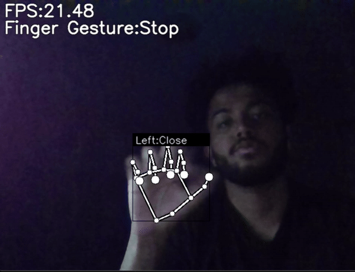

# Hand Gesture Controlled Bionic Arm

## Overview

This project demonstrates a hand gesture-controlled servo system where an Arduino board controls multiple servos based on hand gestures detected by a computer vision system using OpenCV. The goal is to create a system where the position of servos can be adjusted in real-time based on the gestures recognized by the Python application.

## Hand Gesture Recognition



## Components

- **Arduino Board**: Controls the servos.
- **Servos**: Actuate based on gesture commands.
- **Python Application**: Uses OpenCV to detect hand gestures and send corresponding commands to the Arduino.
- **Serial Communication**: Transfers data between Python and Arduino.

## Project Structure

### Arduino Code

**File**: `hand_gesture_servo_control.ino`

This file contains the Arduino code for controlling servos based on commands received via serial communication. It includes functions for initializing servos, reading positions from serial input, and updating servo positions accordingly.

### Python Code

**File**: `app.py`

This file includes the Python application that utilizes OpenCV to detect hand gestures. It sends gesture-based commands to the Arduino via serial communication. It includes functions to send servo commands based on detected gestures.

### Communication Protocol

- **Serial Baud Rate**: 9600 bps (ensure consistency between Python and Arduino code).
- **Data Format**: The Python application sends gesture data in the following format:
  - **Index**: Integer value representing the servo to control.
  - **Value**: Float value representing the desired position for the servo.

## Setup Instructions

### Hardware Setup

1. **Connect Servos**: Connect each servo to the specified pins on the Arduino as defined in the Arduino code.
2. **Connect Arduino to Computer**: Use a USB cable to connect the Arduino to your computer.

### Software Setup

1. **Install Required Libraries**:

   - **Python**: `opencv-python`, `pyserial`
     ```bash
     pip install opencv-python pyserial
     ```
   - **Arduino IDE**: Install the IDE from the [Arduino website](https://www.arduino.cc/en/software).

2. **Upload Arduino Code**:

   - Open `hand_gesture_servo_control.ino` in the Arduino IDE.
   - Select the appropriate board and port.
   - Upload the code to the Arduino.

3. **Configure Python Script**:
   - Open `app.py` and ensure that the serial port (`COM3` or equivalent) and baud rate (9600) are correctly configured.
   - Run the Python script to start gesture detection and control the servos.

## How to Use

1. **Run the Python Script**: Execute `app.py` to start detecting hand gestures and sending commands.
2. **Observe Servo Movements**: The servos should move according to the gestures detected by the Python application.
3. **Adjust Gestures**: Modify the Python code to adjust how gestures are mapped to servo positions.
